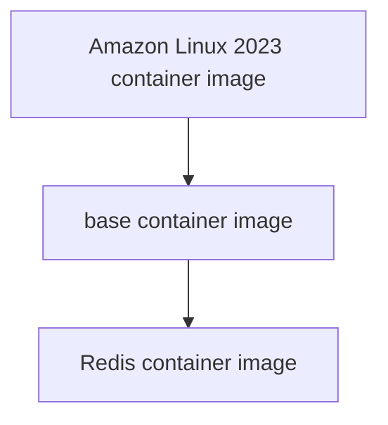

# Development environment

## Prerequisites

- Ensure you installed Docker on your machine. If not, please follow Docker's official documentation.[^1]
- Ensure you cloned our repository.

## Overview

In this setup, we are going to:
1. Write a Dockerfile for building a custom container image for Redis.
2. Build the base and Redis container images.
3. Configure Redis cluster.
4. Run Redis cluster on three containers.

> [!IMPORTANT] 
> I strongly recommend relying on the Redis's official documentation and support services [^2]. In this context, I offer a brief overview of the cluster setup with fundamental configurations.

## Write a Dockerfile

I have written two Dockerfiles, one for the base container image and another for the Redis container image, which already exist in the `docker` directory.

```bash
├── docker
│ ├── dockerfile.base.dev
│ └── dockerfile.redis.7.2.4
```

For best practices,
- Install all the necessary software, including testing and debugging tools, in the base container image. This approach is applicable only for development (DEV) environments.
- Then Download and install Redis in the Redis container image.

## Build the base and Redis container image

Here, I derive the base container image from the **Amazon Linux 2023** container image. Then, I create the Redis container image from the previously derived base container image.



**Step 1:** Switch to the `redis-cluster` directory.

```bash
cd /opt/oss/redis-cluster
```

**Step 2:** Download Redis source from their official website.

```bash
wget https://github.com/redis/redis/archive/7.2.4.tar.gz -P docker/context/binary
```

**Step 3:** Build the base container image.

```bash
docker image build -t redis-base:dev -f docker/dockerfile.base.dev docker/context
```

**Step 4:** Build the Redis container image.  Suppose if you built separate base image for production and named `redis-base:prd`, you can use `--build-arg="ENV=prd"` flag to change the `ENV` argument value in the `dockerfile.redis.7.2.4`.

```bash
docker image build -t redis:v7.2.4 -f docker/dockerfile.redis.7.2.4 docker/context
```

## Configure Redis cluster

When running the cluster setup, it is crucial to maintain quorum for cluster stability. So, we are going to provision three nodes, each being a Docker container. We have already stored the configuration for each node in the `source/conf` directory.  You can get the configuration template from Redis' official documentation [^3].

```bash
├── source
│ └── conf
│     ├── master.conf
│     ├── replica.conf
```

## Run Redis cluster

It is considered good practice to store configuration settings in environment variables and inject these variable values from the shell into **Docker Compose** configuration at runtime.

**Step 1:** Store configurations as environment variables in a file.

- Open a new file. 

```bash
vim docker/default.env
```

- Copy and paste the following content, then save the file.

```bash
REDIS_IMAGE=redis:v7.2.4
REDIS_NODE_IP_RANGES=10.1.1.0/24
REDIS_NODE_1_IP=10.1.1.11
REDIS_NODE_2_IP=10.1.1.12
REDIS_NODE_3_IP=10.1.1.13
```

**Step 2:** Create and start the containers for the Redis cluster.

```bash
docker compose -f docker/compose.yml --env-file docker/default.env -p redis-cluster up -d
```

**Step 3:** Set up the Redis cluster by executing the following command. Only run this command once.

By default Redis Cluster requires at least 3 master nodes and 1 replicas per node.  I am going to run both the master and replica services on all three nodes. The master communicates on port 3000, while the replica communicates on port 3001.

```bash
export NODE=node1
docker container exec -it redis-cluster-${NODE}-1 /usr/local/bin/redis-cli --cluster create 10.1.2.11:3000 10.1.2.21:3000 10.1.2.22:3000 10.1.2.11:3001 10.1.2.21:3001 10.1.2.22:3001 --cluster-replicas 1
```

Verify the formation of the cluster by using the command below; this will list the cluster nodes.

```bash
docker container exec -it redis-cluster-${NODE}-1 /usr/local/bin/redis-cli -p 3000 cluster nodes
```


**Step 4:** Stop and destroy the containers for the Redis cluster.

```bash
docker compose -f docker/compose.yml --env-file docker/default.env -p redis-cluster down
```

## Additional helpful commands

```bash
export NODE=node1
docker container exec -it redis-cluster-${NODE}-1 /bin/bash
docker container exec -it redis-cluster-${NODE}-1 /usr/bin/netstat -ntlp
docker container exec -it redis-cluster-${NODE}-1 /usr/bin/tail -n 200 /opt/redis/log/redis.log
```

- Cluster creation.

```bash
docker container exec -it redis-cluster-${NODE}-1 /usr/local/bin/redis-cli --cluster create 10.1.1.11:3000 10.1.1.12:3000 10.1.1.13:3000 10.1.1.11:3001 10.1.1.12:3001 10.1.1.13:3001 --cluster-replicas 1
```

```
# Sample output.
>>> Performing hash slots allocation on 6 nodes...
Master[0] -> Slots 0 - 5460
Master[1] -> Slots 5461 - 10922
Master[2] -> Slots 10923 - 16383
Adding replica 10.1.2.21:3001 to 10.1.2.11:3000
Adding replica 10.1.2.22:3001 to 10.1.2.21:3000
Adding replica 10.1.2.11:3001 to 10.1.2.22:3000
M: ac890bf2e2f68e6d9fb78ecb343541cdcfea52e3 10.1.2.11:3000
   slots:[0-5460] (5461 slots) master
M: de80094ea9dea4c8e16f3a25de42e87214ba1eb3 10.1.2.21:3000
   slots:[5461-10922] (5462 slots) master
M: 49c4be3036b553122b3e1bf840158cc3160c030b 10.1.2.22:3000
   slots:[10923-16383] (5461 slots) master
S: 141a46c39350309d2bd797a604280e417ba736cf 10.1.2.11:3001
   replicates 49c4be3036b553122b3e1bf840158cc3160c030b
S: dcacee0465055edebc29aa21efbff98a9b6b3265 10.1.2.21:3001
   replicates ac890bf2e2f68e6d9fb78ecb343541cdcfea52e3
S: 92d03cf00df94b66795e2d7677e03fae807af167 10.1.2.22:3001
   replicates de80094ea9dea4c8e16f3a25de42e87214ba1eb3
Can I set the above configuration? (type 'yes' to accept): yes
>>> Nodes configuration updated
>>> Assign a different config epoch to each node
>>> Sending CLUSTER MEET messages to join the cluster
Waiting for the cluster to join

>>> Performing Cluster Check (using node 10.1.2.11:3000)
M: ac890bf2e2f68e6d9fb78ecb343541cdcfea52e3 10.1.2.11:3000
   slots:[0-5460] (5461 slots) master
   1 additional replica(s)
M: de80094ea9dea4c8e16f3a25de42e87214ba1eb3 10.1.2.21:3000
   slots:[5461-10922] (5462 slots) master
   1 additional replica(s)
S: 92d03cf00df94b66795e2d7677e03fae807af167 10.1.2.22:3001
   slots: (0 slots) slave
   replicates de80094ea9dea4c8e16f3a25de42e87214ba1eb3
M: 49c4be3036b553122b3e1bf840158cc3160c030b 10.1.2.22:3000
   slots:[10923-16383] (5461 slots) master
   1 additional replica(s)
S: dcacee0465055edebc29aa21efbff98a9b6b3265 10.1.2.21:3001
   slots: (0 slots) slave
   replicates ac890bf2e2f68e6d9fb78ecb343541cdcfea52e3
S: 141a46c39350309d2bd797a604280e417ba736cf 10.1.2.11:3001
   slots: (0 slots) slave
   replicates 49c4be3036b553122b3e1bf840158cc3160c030b
[OK] All nodes agree about slots configuration.
>>> Check for open slots...
>>> Check slots coverage...
[OK] All 16384 slots covered.
```

- List cluster nodes.

```bash
docker container exec -it redis-cluster-${NODE}-1 /usr/local/bin/redis-cli -p 3000 cluster nodes
```

```
# Sample output.
de80094ea9dea4c8e16f3a25de42e87214ba1eb3 10.1.2.21:3000@13000 master - 0 1706206810479 2 connected 5461-10922
ac890bf2e2f68e6d9fb78ecb343541cdcfea52e3 10.1.2.11:3000@13000 myself,master - 0 1706206808000 1 connected 0-5460
92d03cf00df94b66795e2d7677e03fae807af167 10.1.2.22:3001@13001 slave de80094ea9dea4c8e16f3a25de42e87214ba1eb3 0 1706206807458 2 connected
49c4be3036b553122b3e1bf840158cc3160c030b 10.1.2.22:3000@13000 master - 0 1706206807000 3 connected 10923-16383
dcacee0465055edebc29aa21efbff98a9b6b3265 10.1.2.21:3001@13001 slave ac890bf2e2f68e6d9fb78ecb343541cdcfea52e3 0 1706206809472 1 connected
141a46c39350309d2bd797a604280e417ba736cf 10.1.2.11:3001@13001 slave 49c4be3036b553122b3e1bf840158cc3160c030b 0 1706206809000 3 connected
```

- Get shell access of the Redis server.

```bash
docker container exec -it redis-cluster-${NODE}-1 /usr/local/bin/redis-cli -c -h 10.1.1.11 -p 3000
```

## References
- [Redis lab documentation](https://developer.redis.com/operate/redis-at-scale/scalability/exercise-1/)

[^1]: [Docker Engine installation](https://docs.docker.com/engine/install)
[^2]: [Redis official documentation](https://redis.io/docs/management/scaling/)
[^3]: [Redis configuration file](https://redis.io/docs/management/config-file/)
